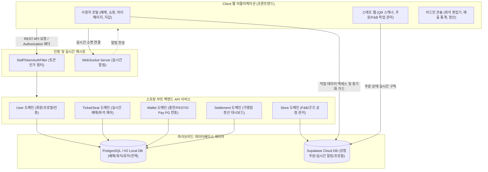
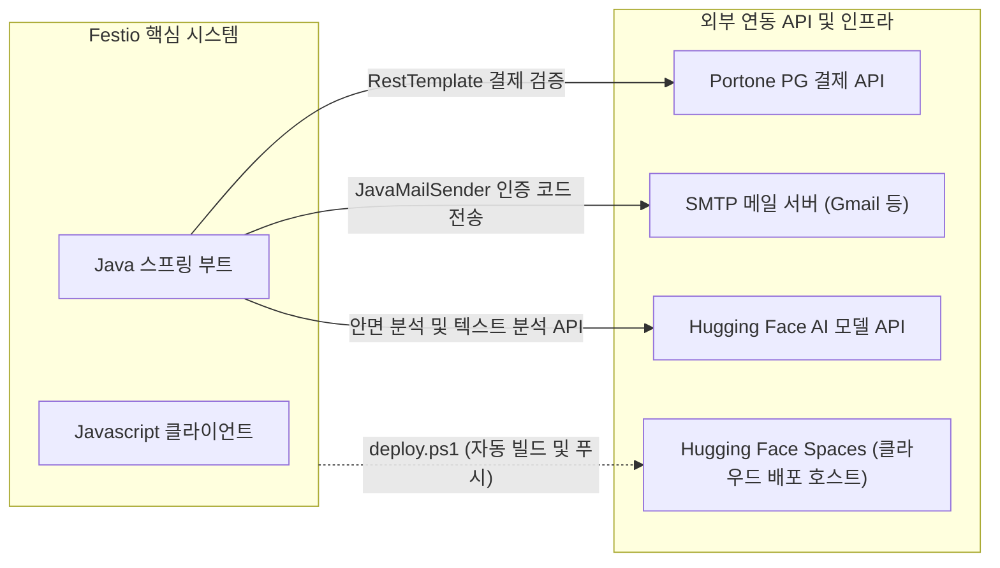

# Festio 전체 시스템 아키텍처 가이드

본 문서는 Festio 페스티벌 통합 관리 플랫폼의 프론트엔드 멀티 채널, 스프링 백엔드 도메인 컨트롤러, 그리고 하이브리드 데이터베이스를 포함한 **전체 시스템 아키텍처**를 정의합니다.

---

## 1. 전체 시스템 개념 아키텍처

Festio는 다중 프론트엔드 역할군(사용자, 스태프, 어드민)이 단일 스프링 백엔드 API와 Supabase 실시간 클라우드를 공유하는 **하이브리드 데이터 분산 구조**로 설계되었습니다.

---

## 2. 도메인별 세부 아키텍처 및 데이터 흐름

### 2.1. 사용자/회원 인증 도메인 (Authentication & Authorization)
* **흐름**: 사용자가 로그인에 성공하면 백엔드에서 고유 토큰(`festio-jwt-token-{UUID}`)을 클라이언트에 반환하며, 클라이언트는 이를 LocalStorage에 저장하여 모든 REST API 요청 시 `Authorization` 헤더에 실어 보냅니다.
* **Spring Security 통합**: `StaffTokenAuthFilter`가 모든 API 호출 시 `Authorization` 헤더를 가로채어 토큰을 잘라내고, DB(`app_user`)에서 사용자의 Role(`ROLE_USER`, `ROLE_STAFF`, `ROLE_ADMIN`)을 확인한 뒤 Spring Security SecurityContext에 인가 상태를 영속화하여 엔드포인트 접근을 제어합니다.

### 2.2. 페스티벌 좌석 지정 및 예매 도메인 (Ticketing & Seat Mapping)
* **동적 구역 렌더링**: 어드민이 SVG 좌석 편집기(`seat-editor.js`)를 사용하여 좌석 정보를 생성하면 백엔드의 `SeatController`가 데이터베이스(`seats`)에 저장하며, 프론트엔드는 실시간 예약 상태(예약 완료, 예약 중, 사용 불가)를 시각적으로 렌더링합니다.
* **실시간 런타임 시작 시간 검증**: 주문 API(`/api/order/ticket`) 호출 시 백엔드는 현재 서버 시간을 기준으로 페스티벌 시작 일시를 실시간 비교하여, 이미 시작한 축제에 대한 부정/중복 예매를 원천 차단합니다.
* **보안 TOTP QR 입장 처리**: 마이페이지에서 입장용 QR 요청 시, `orders` 테이블에 저장된 `secret` 값을 기반으로 3분마다 갱신되는 OTP 번호가 담긴 dynamic 바코드를 발급하고, 게이트 스태프 앱(`staff-scan.js`)에서 이를 해독하여 입장을 처리합니다.

### 2.3. FESTIO Pay 충전 및 결제 도메인 (Wallet System)
* **PG 충전 연동**: Portone(아임포트) 외부 결제 게이트웨이를 사용하여 토스페이, 카카오페이 등 실제 수단으로 충전금액을 이체하고 백엔드 지갑 DB(`app_user.balance`)를 갱신합니다.
* **자동 충전(Auto-Recharge) 및 결제 체이닝**: 
  * 결제 시도 시 잔액이 부족하면 결제 모듈이 즉시 가상 결제 프로세스 혹은 충전 API(`/api/wallet/charge`)를 호출하여 부족한 금액만큼 충전을 자동 수행합니다.
  * 충전이 완료되는 즉시 원래의 결제 API(`/api/wallet/pay`)를 다시 호출하는 체이닝(Chain) 방식으로 트랜잭션을 매끄럽게 마무리합니다.
* **이중 DB 잔액 동기화**: 백엔드 잔액 테이블의 정합성 처리가 완료된 직후, 프론트엔드가 이를 읽어 Supabase의 `shop_profiles` 내 포인트를 동기화하여 지갑 탭과 상점 탭 간 잔액의 시간차가 발생하지 않도록 락(Lock)을 겁니다.

### 2.4. F&B 및 굿즈 상점 도메인 (Store & Order Management)
* **가맹점 데이터 엑세스**: 굿즈 샵 및 푸드트럭은 Supabase의 `shop_profiles` 및 `shop_orders` 테이블에 의존합니다. 카테고리 필터링, 메뉴 상세 조회, 수량 제한 등은 프론트엔드와 Supabase 간의 직접적인 CRUD 통신을 기반으로 작동해 트래픽을 효율적으로 분산시킵니다.
* **스태프 정산 대시보드 (Settlement)**: 축제 종료 후 가맹점 정산을 위해 `SettlementController`가 로컬 및 클라우드 주문 정보를 종합 쿼리하여 가맹점의 총매출, 수수료, 순수익 정산 내역을 산출하고 대시보드 화면에 통계를 표시합니다.

### 2.5. 실시간 소통 및 1:1 문의 도메인 (WebSocket Notifications)
* **실시간 알림 아키텍처**: 문의하기 등록 및 답변 알림은 WebSocket 연결을 통해 관리됩니다. `MockWebSocket` 통신 구조를 통해 사용자의 1:1 문의글이 등록되거나 스태프의 실시간 답변이 달리면, 마이페이지의 문의 아이콘 및 알림 배지가 새로고침 없이 동적으로 갱신됩니다.

---

## 3. 외부 시스템 연동 및 인프라 배포 아키텍처

Festio는 서비스의 완성도를 높이고 보안을 확보하기 위해 다양한 서드파티 서비스 및 인프라 모듈을 통합 연동하고 있습니다.

### 3.1. Portone PG 외부 결제 검증 연동 (Payment Verification)
* **목적**: 프론트엔드에서 결제창 호출 및 실제 이체 처리가 끝난 후, 결제 금액 위변조를 검증합니다.
* **흐름**: 백엔드 `WalletController`가 `RestTemplate`을 사용하여 Portone API에 인증 토큰 발급을 요청하고, 해당 결제 식별값(`imp_uid`)으로 포트원 서버에 직접 결제 상세 내역을 조회해 데이터베이스(`orders.total_price`)와 금액이 일치하는지 2차 서버 검증을 수행합니다.

### 3.2. SMTP 메일링 본인 인증 서비스 (Mail Verification Service)
* **목적**: 회원가입 및 주요 계정 복구를 위한 이메일 본인 확인 기능.
* **흐름**: `AuthController`에서 `MailService`의 `JavaMailSender` 설정을 통해 지정 이메일로 6자리 난수 인증 코드를 포함한 템플릿 메일을 발송합니다. 사용자가 브라우저에서 코드를 입력하면 캐싱 메모리 또는 DB에 보관된 난수 값과 비교하여 본인 여부를 인증합니다.

### 3.3. AI 서비스 연동 (Hugging Face AI Integration)
* **목적**: 축제 입장 검증을 위한 지능형 안면 벡터(Face Vector) 매핑 및 챗봇 피드백 분석.
* **흐름**: `StaffSpecificationController` 등에서 외부 AI API 호출 시 필요한 `HF_API_KEY`를 시스템 환경 변수(Environment Variables)에서 안정적으로 주입받아 API 헤더 인증 후 모델 결과를 수신 및 가공합니다.

### 3.4. 파이프라인 및 클라우드 배포 스크립트 (Deploy Pipeline)
* **목적**: 빌드 산출물을 클라우드 환경에 무중단/자동 배포합니다.
* **흐름**: 루트 디렉토리의 `deploy.ps1` 스크립트(Powershell)를 사용하여, 로컬 정적 리소스(HTML/JS) 빌드 및 Java Jar 아카이빙을 한 번에 실행한 후 `git push main`을 통해 지정된 Hugging Face Spaces 클라우드 레포지토리로 소스 코드를 통합 전송하여 빌드 서버에서 자동 컴파일 및 호스팅되도록 구성했습니다.

