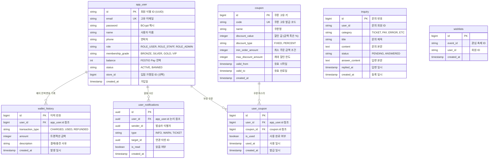
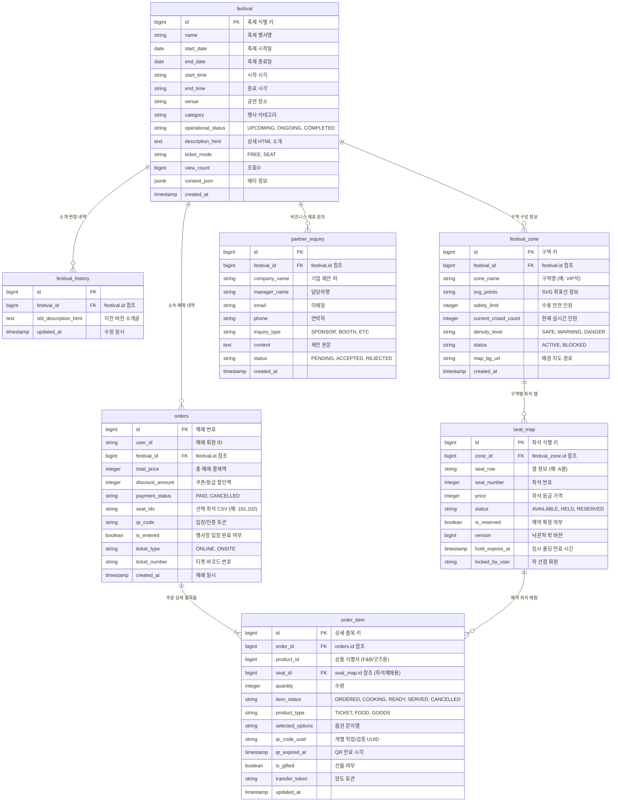

# FESTIO 페스티벌 통합 플랫폼 - 도메인 분할형 ERD 명세서

본 문서는 Festio 플랫폼에 구축된 **전체 28개 테이블**의 물리 스키마 정보와 릴레이션을 비즈니스 관심사에 맞춰 **3대 핵심 도메인으로 분할 정의**하여 가독성을 극대화한 프로페셔널 데이터베이스 디자인 문서입니다.

---

## 1. [도메인 1] 회원, 계정 보안 및 결제/쿠폰 (Identity & Wallet & Coupons)

회원 자격 증명, FESTIO Pay 지갑 결제 이력, 지급된 쿠폰 및 일반 알림/고객 문의 등 플랫폼 공통 계정 도메인입니다.

### 1.1. ERD (Mermaid)

---

## 2. [도메인 2] 축제 정보 및 좌석 예매 (Festival & Seating & Ticketing)

축제 정보 구성, 행사 구역 밀집도 제어, 실시간 좌석도 맵핑 및 티켓 예매 트랜잭션을 처리하는 핵심 축제 서비스 도메인입니다.

### 2.1. ERD (Mermaid)

---

## 3. [도메인 3] 상점, 모바일 스마트오더 및 실시간 픽업/정산 (Store & Smart Order & Settlement)

축제 내부 가맹점 관리, 모바일 장바구니/스마트오더 결제 트랜잭션, 점주용 오더 수락 및 조리 현황, 그리고 정산 및 리뷰 도메인입니다.

### 3.1. ERD (Mermaid)

```mermaid
erDiagram
    store {
        bigint id PK "가맹점 고유 키"
        bigint festival_id "참여 축제 ID"
        bigint zone_id "위치 구역 ID"
        string name "가맹점/푸드트럭명"
        string category "FOOD, GOODS"
        string operating_hours "영업시간"
        double_precision map_x_percent "지도상 X 위치"
        double_precision map_y_percent "지도상 Y 위치"
        boolean is_open "영업 여부"
        string booth_number "부스 번호"
        string notice "점포 공지사항"
        text image_url "점포 전경 이미지"
        timestamp created_at
    }

    product {
        bigint id PK "상품 식별 키"
        bigint store_id FK "store.id 참조"
        string name "상품/메뉴명"
        integer price "판매 금액"
        text image_url "메뉴 썸네일"
        integer total_stock "총 재고량"
        integer reserved_stock "예약 대기 재고"
        integer available_stock "실 판매가능 가용 재고"
        boolean is_soldout "품절 여부"
        string status "ACTIVE, INACTIVE"
        string product_type "FOOD, GOODS"
        boolean is_representative "대표 메뉴 여부"
        string option_groups_json "옵션 그룹 규격 (JSON)"
        timestamp created_at
    }

    settlement {
        bigint id PK
        bigint store_id FK "store.id 참조"
        string settlement_month "정산 월 (YYYY-MM)"
        integer total_sales_amount "총 매출액"
        integer commission_fee "수수료"
        integer final_payout_amount "최종 지급액"
        string status "CALCULATED, PAID"
        timestamp updated_at
    }

    review {
        bigint id PK
        bigint store_id FK "store.id 참조"
        bigint festival_id "참여 축제 ID"
        bigint order_item_id "로컬 아이템 ID"
        integer rating "별점 (1~5)"
        text content "리뷰 내용"
        text image_url "첨부 이미지"
        string user_id "작성자 ID"
        timestamp created_at
    }

    scan_log {
        bigint id PK
        bigint order_item_id "스캔 대상 아이템"
        bigint staff_user_id "스캔 처리 스태프"
        string scan_type "PICKUP, ENTRANCE"
        string result "SUCCESS, EXPIRED, INVALID"
        timestamp scanned_at
    }

    shop_profiles {
        uuid id PK "Supabase 프로필 고유 키"
        string user_email UK "고객 이메일"
        string user_name "고객명"
        text avatar_url "프로필 사진"
        integer festio_pay_points "FESTIO Pay 온라인 포인트"
        integer total_spent "누적 사용금액"
        string tier "고객 등급"
        boolean noti_food_truck "푸드트럭 알림 설정"
        boolean noti_shipping "배송 알림 설정"
        boolean noti_marketing "마케팅 동의"
        timestamp created_at
    }

    shop_products {
        uuid id PK "온라인 카탈로그 상품 ID"
        string type "FOOD, GOODS"
        string name "메뉴명"
        text description "설명"
        integer price "단가"
        integer stock_quantity "재고"
        text image_url
        jsonb options "옵션 규격"
        boolean is_active "노출 활성화"
        string store_name "소속 매장 이름"
        timestamp created_at
    }

    shop_orders {
        bigint id PK "Supabase 주문 헤더 ID"
        string order_number UK "고유 주문 번호"
        string user_email "주문자 이메일"
        string user_name "주문자명"
        string user_phone "연락처"
        integer total_price "총 주문 금액"
        integer discount_amount "할인액"
        integer final_price "실제 결제액"
        text payment_method "FESTIO_PAY, CARD"
        text status "PAID, COOKING, READY, COMPLETED, CANCELLED"
        text secret_key "QR TOTP 검증 키"
        text delivery_type "PICKUP, DELIVERY"
        timestamp created_at
    }

    shop_order_items {
        bigint id PK "Supabase 주문 상세 ID"
        bigint order_id FK "shop_orders.id 참조"
        uuid store_id "점포 ID"
        string store_name "점포명"
        uuid product_id FK "shop_products.id 참조"
        string product_name "메뉴명"
        integer qty "수량"
        integer unit_price "단가"
        jsonb options "선택한 옵션 결과"
        timestamp created_at
    }

    shop_cart {
        bigint id PK
        string user_email
        uuid product_id FK "shop_products.id 참조"
        integer qty
        jsonb options
        timestamp created_at
    }

    shop_notifications {
        uuid id PK
        uuid profile_id FK "shop_profiles.id 참조"
        text title
        text message
        boolean is_read
        text target_url
        timestamp created_at
    }

    shop_store_settings {
        text store_name PK "매장명"
        integer manual_wait_time "예상 대기 시간"
        boolean is_manual_active "대기 시간 적용 여부"
        timestamp updated_at
    }

    store_wait_time_logs {
        bigint id PK
        text store_name
        integer old_time
        integer new_time
        text change_reason
        text changed_by
        timestamp created_at
    }

    inventory {
        bigint id PK
        string product_name
        string product_type
        integer price
        integer available_stock
        integer current_stock
        integer pre_allocated_stock
        string image_url
    }

    store ||--|{ product : "메뉴 관리"
    store ||--o{ settlement : "정산 수수료"
    store ||--o{ review : "점포 리뷰 평가"
    shop_orders ||--|{ shop_order_items : "주문 품목 포함"
    shop_products ||--o{ shop_order_items : "주문된 상품"
    shop_products ||--o{ shop_cart : "카트 적재"
    shop_profiles ||--o{ shop_notifications : "전송된 푸시 알림"
```

