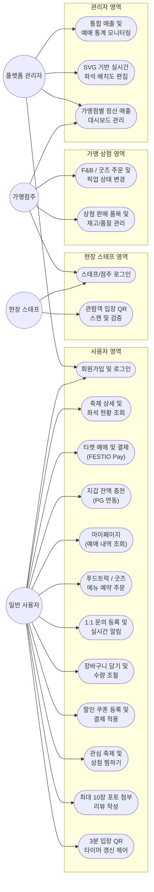

# Festio 시스템 유스케이스 다이어그램

본 문서는 Festio 페스티벌 통합 플랫폼의 **역할군별 주요 기능 및 권한 범위**를 도식화한 유스케이스 다이어그램 명세서입니다.

---

## 1. 유스케이스 다이어그램 (Mermaid)

---

## 2. 역할군별 유스케이스 상세 정의

### 2.1. 일반 사용자 (User / Client)
* **회원가입 및 로그인**: 이메일 본인 인증 절차를 거쳐 계정을 생성하고 일반 사용자 토큰(`ROLE_USER`)을 부여받습니다.
* **축제 및 좌석 조회**: 활성화된 페스티벌의 일정, 소개, 구역별 실시간 예약 가능 좌석 현황을 시각적으로 확인합니다.
* **티켓 예매 및 결제**: FESTIO Pay 지갑 또는 일반 신용카드를 사용하여 예매를 완료하고 예매 주문 데이터를 등록합니다.
* **지갑 충전 및 자동 충전**: 공식 지갑에 포트원 PG 연동을 통해 토스/카카오페이 등으로 잔액을 충전하며, 예매 시 잔액이 부족할 경우 부족분만큼 자동 결제 충전을 연쇄적으로 처리합니다.
* **마이페이지 & QR**: 예매한 티켓의 내역을 조회하고, 현장 검증을 위한 3분 제한 Dynamic QR을 화면에 호출합니다.
* **메뉴 예약 주문**: 축제 입점 푸드트럭이나 굿즈 상점의 상품을 선택하여 선결제 예약 주문을 전송합니다.
* **1:1 문의 및 알림**: 서비스 및 운영 관련 문의글을 작성하고 스태프의 실시간 답변 달림을 WebSocket을 통해 브라우저 배지로 실시간 수신합니다.
* **장바구니 관리**: 여러 상점의 메뉴 및 굿즈들을 선택해 장바구니에 임시 적재하고 수량을 유연하게 가감 조절하여 일괄 결제를 태웁니다.
* **할인 쿠폰 활용**: 신규 웰컴 쿠폰 또는 프로모션 코드를 등록하고 결제창에서 적용하여 최종 결제액을 할인받으며, 사용하지 않는 쿠폰은 직접 목록에서 삭제할 수 있습니다.
* **관심 항목 위시리스트**: 마음에 드는 페스티벌 행사와 푸드트럭/상점들에 대해 하트를 클릭해 찜하고, 마이페이지에서 모아봅니다.
* **다중 포토 후기 작성**: 입장 및 사용 완료된 티켓들을 기반으로 평점 및 최대 10장의 포토 파일을 썸네일 미리보기와 함께 업로드하여 리뷰를 등록합니다.
* **QR 타이머 및 갱신 제어**: 발급된 입장용 QR의 유효시간인 180초 타이머의 흐름을 시각적으로 확인하고, 필요 시 수동 갱신 버튼을 눌러 새로운 보안 TOTP 토큰을 재발행받습니다.

### 2.2. 현장 스태프 (Staff)
* **스태프 로그인**: 할당받은 현장 스태프 계정으로 로그인하여 게이트 관리 전용 메뉴에 접근합니다.
* **입장 QR 스캔**: 현장 게이트에서 관람객의 QR 바코드를 전송받아 TOTP 유효성 및 티켓 기사용 여부를 확인하여 실시간 입장을 승인합니다.

### 2.3. 가맹점주 (Merchant)
* **상점주 로그인**: 상점 권한을 부여받은 계정으로 로그인하여 가맹 상점 대시보드에 접근합니다.
* **판매 상품 및 재고 관리**: 판매 품목의 신규 등록, 가격 변경 및 실시간 품절/판매 재개 여부를 제어합니다.
* **주문/픽업 상태 관리**: 현장 사용자의 선주문 내역을 모니터링하고 주문 완료/조리 완료/수령 완료 상태로 실시간 업데이트합니다.
* **정산 대시보드 조회**: 수수료를 공제한 총 가맹 상점의 기간별 정산 누적 금액 및 통계 자료를 조회합니다.

### 2.4. 플랫폼 관리자 (Admin)
* **통계 모니터링**: 전체 가입 회원 목록 관리, 총 티켓 판매 현황 및 매출액 통계를 종합 조회합니다.
* **좌석 배치도 편집**: 페스티벌 구역별로 실시간 SVG 노드를 수정/추가하여 예매용 배치도를 동적 설계합니다.
* **정산 대시보드 관리**: 축제 입점 가맹점들과의 최종 거래 금액에 맞추어 수수료를 정산하고 매출 리포트를 관리합니다.
